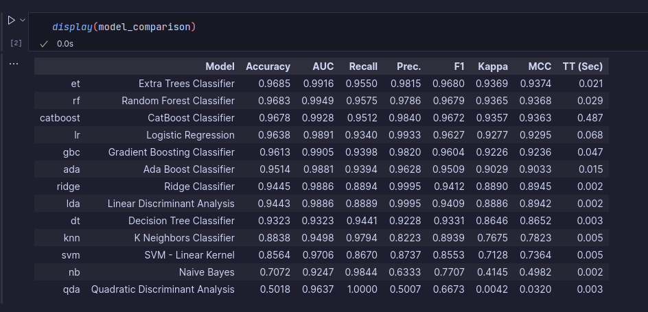
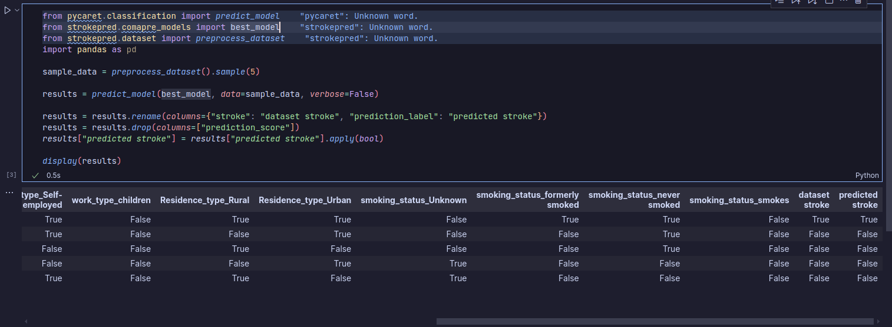

# Tworzenie modelu

!!! tip
    Na podstawie `strokepred/compare_models.py` oraz `strokepred.ipynb`

## Porównanie modeli

Do porównania modeli możemy wykorzystać funkcję `compare_models` z biblioteki `pycaret`.
Po wykonaniu tej funkcji otrzymaliśmy wyniki dla różnych modeli, które możemy porównać.



Patrząc na powyższą tabelę możemy wyróżnić następujące modele:

1. **Extra Trees Classifier** - jest to model z najwyższym wynikiem "Accuracy" oraz "F1". Również należy do modeli z krótkim czasem uczenia.
2. **CatBoost Classifier** - mimo, że nie jest to model z najwyższym wynikiem "Accuracy", jednakże balansuje wszystkie miary, co daje mu wysoką pozycję w rankingu. Jest to model, który będzie bardziej "ostrożny" w klasyfikacji.
3. **Random Forest Classifier** - osiąga 2 najwyższy wynik "Accuracy" jednakże, rozstrzał w innych miarach jest większy niż w przypadku modelu "Extra Trees Classifier" czy "CatBoost". Jest to model, który będzie bardziej "ostrożny" w klasyfikacji, jednakże charakteryzuje się lepszą dokładnością niż "CatBoost" oraz jest szybszy (mniejszy TT).

!!! abstract
    Powyższa tabela pokrywa się z wnykami [dotychczasowych badań dotyczących przewidywania udarów](https://pubmed.ncbi.nlm.nih.gov/39355095/).

## Wybór modelu

Na postawie powyższych wyników możemy wybrać model **Random Forest Classifier (rf)**, ponieważ ma najlepsze wyniki i jego zasady działania będą dobrze się sprawdzać w naszym przypadku.

### Dlaczego Random Forest?

 - Random Forest potrafi dobrze radzić sobie z niezrównoważonymi danymi poprzez techniki jak class_weight

 - Ryzyko udaru zależy od wielu czynników w sposób nieliniowy

 - Random Forest, poprzez budowę wielu drzew decyzyjnych, potrafi uchwycić złożone, nieliniowe relacje między zmiennymi

 - Technika bootstrap aggregating (bagging) stosowana w Random Forest redukuje ryzyko przeuczenia

 - Pozwala zidentyfikować najważniejsze czynniki ryzyka udaru

 - Dobrze radzi sobie z różnymi skalami zmiennych

## Przykładowe uruchomienie



!!! example
    Model można ręcznie przetestować uruchamiając ipynb w dockerze

    ```
    docker run -it --rm -p 8888:8888 s24477/strokepred:notebook
    ```